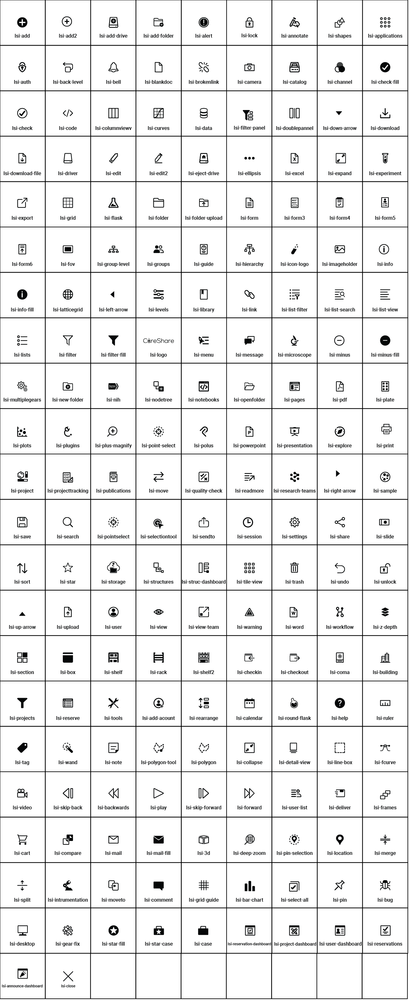

# Labshare Icons font

## How to use
1. install `npm i --save @labshare/ls-font`
2. add import to scss file `@import "/node_modules/@labshare/ls-font/css/lsfontset.css";`

## Icon Library 

## Version Push
